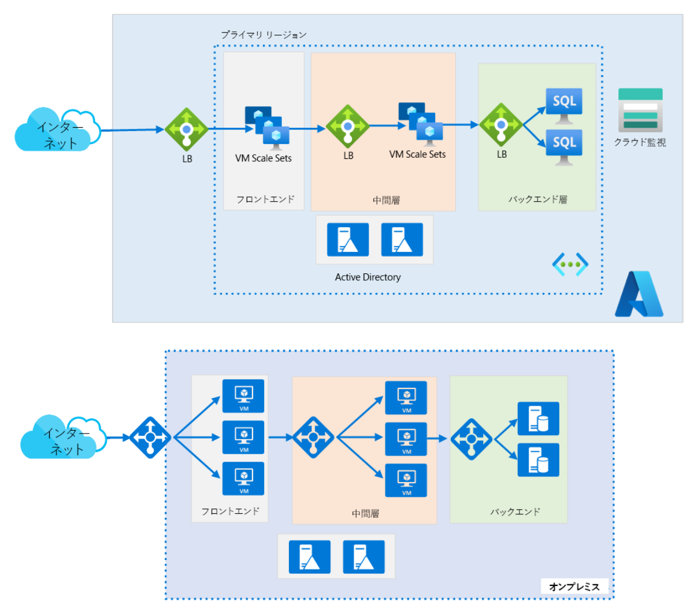
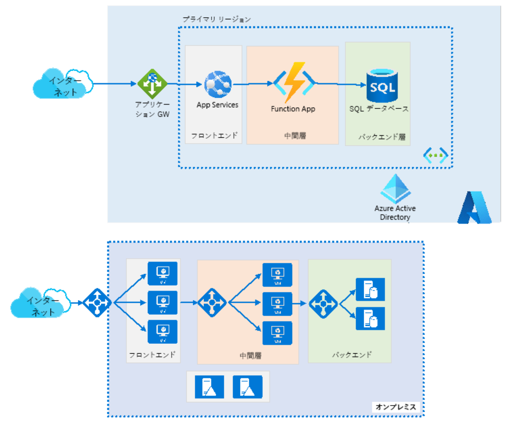

**コンピューティング ソリューションを設計する**

***

**IaaSソリューション例**

**PaaSソリューション例**

***

# フロントエンド層：フロントエンド階層には、どの Azure コンピューティング サービスを推奨しますか?

- **Azure VM スケール セット (VMSS)** を使用して、自動スケールの要件を満たすことができます。顧客のリクエストが増減すると、VMSS は自動的にスケールします。可用性セットまたはゾーンを作成することもお勧めします。

- 最適な選択は、**Azure App Service Web** アプリです。この Web アプリは自動スケールをサポートし、.NET Core ベースの Web アプリをホストできます。 可用性ゾーンを使用することをお勧めします。

- 問題を確実に解決するには、**Application Monitoring** と **Application Insights** をお勧めします。これらの製品は、詳細な IIS Web サーバー/クライアント パフォーマンス メトリックを提供します。これは、SLA の問題を検出し、サポート担当者を待っている間にしきい値を超えたユーザーに通知するのに役立ちます。

- VMSS と App Services の両方のスケーリングが必要ですか?

# 中間階層アプリケーションには、どの Azure コンピューティング サービスを推奨しますか?

- **Azure Functions** は、カスタマー ヘルプ デスクへのリクエストなどのメッセージ キューを管理する機能を提供します。この機能により、記述するコードを減らし、より少ないインフラストラクチャを維持して、コストを節約できます。サーバーの展開と保守について心配する代わりに、クラウド インフラストラクチャは、必要となるすべての最新のリソースを提供します。
- リクエストが増えると、Azure Functions は、必要な数のリソースと関数インスタンスで要件を満たしますが、必要な場合に限ります。リクエストが発生すると、余分なリソースとアプリケーション インスタンスは自動的に削除されます。
- Azure Functions は、イベントによってトリガーできます。たとえば、顧客が電子メールの送信を選択したとします。また、Azure Functions では、監視とログ記録を利用できます。
- **API Management** も考慮する必要があります。 APIM は、調整、キャッシング、認証などのポリシーを可能にします。 中間層が後でマイクロサービス モデルに拡張または移行する場合、APIM は、多くのバックエンド API ロケーションに接続またはリダイレクトする柔軟性を備えた単一のフロントエンド アクセス ポイントを実現します。 また、APIM では、トラフィックの追加のログ記録と視覚化が可能です。