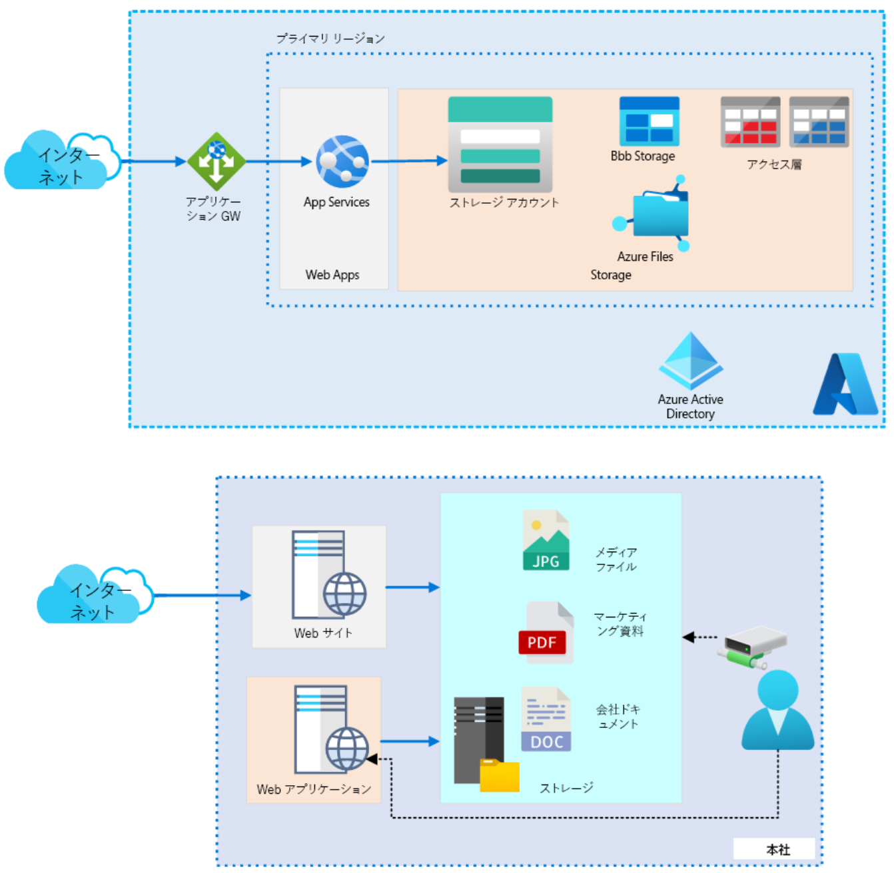

**非リレーショナル ストレージ の ケース スタディを設計する**

***

# Tailwind Traders のストレージ ソリューション例

- すべてのコンテンツは**非リレーショナル**として分類されます。

- 設計では、ファイルの場所、コンプライアンスと規制の要件、パフォーマンス、およびストレージの複製を考慮する必要があります。また、ソリューションはコスト効率が高く、一元管理が容易である必要があります。

- メディア ファイルと企業ファイルの場合は **Blob Storage** をお勧めします。Blob Storage はより安価であり、法的な不変のストレージ要件を提供し、内部アプリケーションの API アクセスをサポートします。

- マーケティング資料の場合は **Azure Files** をお勧めします。 ファイルは SMB を介して内部的にアクセスされるため、マーケティングには Azure Files が必要です。

- ローカルの Windows Server とファイル同期を使用することで、内部ユーザーのマーケティング資料へのアクセスの待ち時間を短縮できます。

- **ゾーン冗長ストレージ**をお勧めします。ファイルがミッション クリティカルである場合は、Geo 冗長ゾーン ストレージについて検討できます。フロント エンドがセカンダリ リージョンを利用できる場合は、読み取りアクセスの Geo 冗長ストレージを使用できます。この決定は、顧客の場所とトラフィックによって異なります。

- ホット層は、1 年未満のすべてのメディア、マーケティング資料、および企業文書に使用する必要があります。アーカイブ層またはコールド層は、1 年以上前の企業文書に使用する必要があります。この決定は、取得の待ち時間、保存期間、およびコストを削減したいという要望に基づいています。 コールドとアーカイブのどちらかを決定するのに十分な情報が提供されていないことについて話し合い、Tailwind Traders に尋ねる可能性がある追加の質問を尋ねます。 **ライフサイクル管理**を使用して、1 年後に企業文書をより安価なストレージ階層に変換する必要があります。

- **プライベート エンドポイント**と**ファイアウォール ポリシー**を適用する必要があります。 
