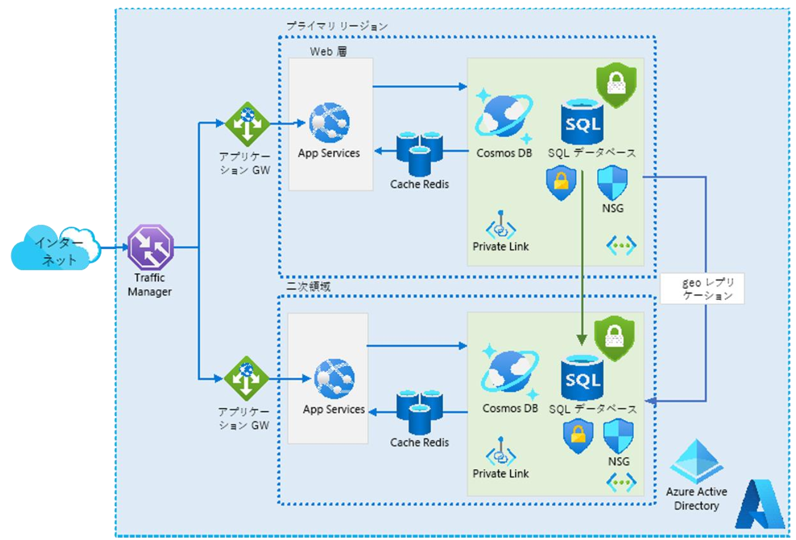

**リレーショナル ストレージ の ケース スタディを設計する**

***

# タスク1：データベース ソリューションを設計します。設計には、承認、認証、価格設定、パフォーマンス、高可用性を含める必要があります。

ソリューション例

- 承認
  - **Azure SQL データベースとサーバー レベルのファイアウォール機能**を活用して承認を制御し、Tailwind Traders の顧客向け Web サーバーからのアクセスのみを許可できます。また、**プライベート エンドポイント**により、Azure SQL データベースの攻撃対象領域を削減できます。さらに、セキュリティの追加レイヤーを実装するために **NSG** を実装することもできます。潜在的な脅威を修正し、業界標準のベスト プラクティスと照合してレポートを取得するには、**Azure Defender for SQL** を有効にすることを検討してください。データを保護するには、**透過的データ暗号化 (TDE)**、**動的データ マスク**、および**常に暗号化**の実装を検討してください。
- 認証
  - 認証の観点から、Tailwind Traders の **Active Directory 環境を Azure Active Directory と統合**すると、内部ユーザーは Active Directory の資格情報を使用して Azure SQL データベースに対して認証できるようになります。Azure Web アプリなどの他の Azure リソースから Azure SQL Database へのアクセスを提供するには、それらを**マネージド ID** に関連付けます。
- 価格
  - お客様がデータベース エンジンまたはホスト OS を引き続き制御する必要がないため、**Azure SQL Database** をお勧めします。テスト フェーズまたはパイロット フェーズで互換性の問題が見つかった場合は、**VM 上の Azure SQL Managed Instance または SQL Server** が必要になる場合があります。
- パフォーマンス
  - Azure に移行し、**Azure SQL データベース**に十分なリソースを割り当てるだけで、前述のパフォーマンスの問題を解決できます。 ただし、**データをシャーディングし、製品カタログを NoSQL CosmosDB に移行することを検討する**場合があります。 これにより、CosmosDB が提示するマテリアライズド ビューにより、応答時間が短縮される可能性があります。 さらに、データベースは簡単にグローバルに分散できます。 これを実行するには多大な努力が必要になる可能性がありますが、より優れた長期的なソリューションが得られる可能性があることに注意してください。
-  高可用性
   - 説明に記載されている高可用性の目標に基づいて、**Business Critical** をお勧めします。具体的には、リレーショナル データを格納するだけでなく、**低遅延**、**高スループットのトランザクション**、**常時接続の高可用性**、および**複数の読み取り専用レプリカ**のサポートを提供するという差し迫ったニーズを満たします。異なる Azure リージョンに読み取り専用レプリカをデプロイすることで、Web サイトのフロントエンドの設計に応じて、これらの他のリージョンに存在する顧客からの読み取り操作の待機時間を最小限に抑えることもできます。