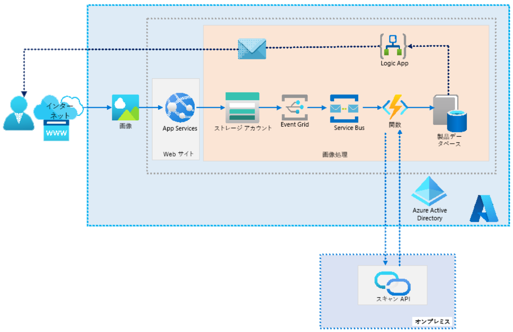

**アプリのアーキテクチャ ソリューションを設計する**

***

# 顧客の画像を会社の Web サイトに追加するためのアーキテクチャを設計します

**ソリューション例**

- ストレージ アカウント BLOB 画像の保存に使用することを検討します。 Web アプリケーションで SMB または NFS が必要な場合はファイルを使用できますが、Blob Storage は低コストで一般的に多くの機能を提供します。
- 新しいストレージ BLOB を作成したときに Event Grid を通知の作成に使用することを検討します。
- Service Bus キューを Event Grid 通知の保持に使用することを検討します。 キューの使用は、ロードバランスを取るのに役立ち、配信保証を通じてイベントが見逃されないように保証することができます。
- 機能は、キューからメッセージを取得し、処理のためにスキャン API に送信するサーバーレスオプションを提供します。
- Logic Apps には、SQL データベース アイテムの作成や変更など、トリガーされたイベントに基づいてメールを送信するための、コードフリーの簡単なオプションが用意されています。

