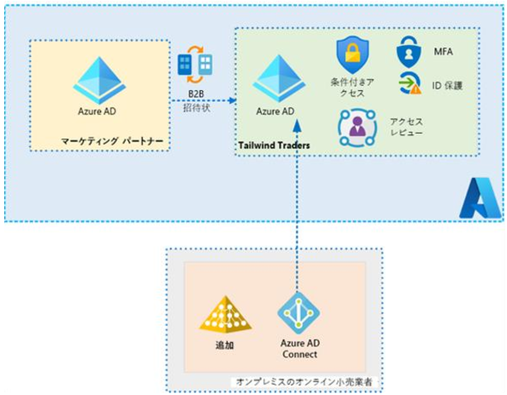
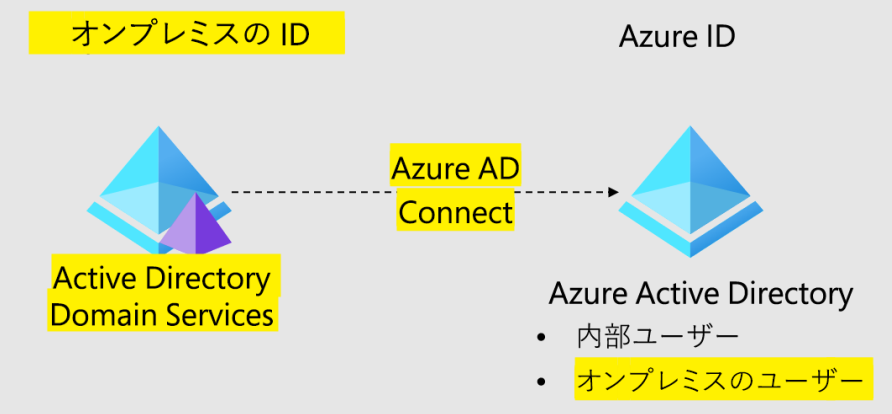
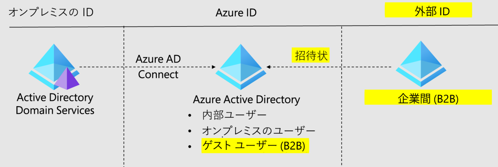
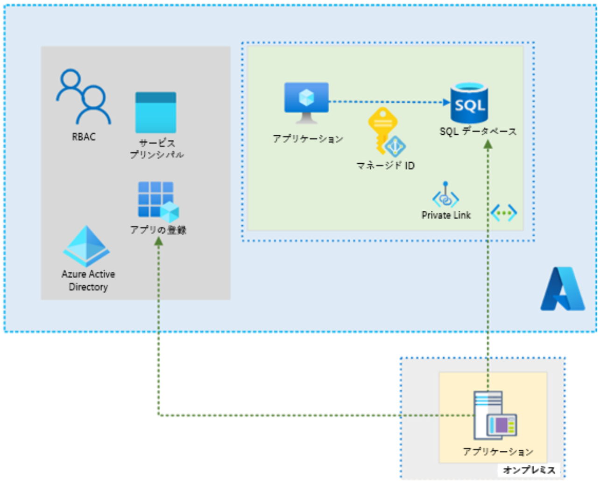

**認証および承認ソリューションを設計する**

***

# 新しい従業員のユーザー アカウント

**ソリューション例**

- オンプレミスユーザーは、Azure AD Connect を使用して同期できます。Azure AD に新しいグループが必要ですか? 使用する Azure AD グループを決定する方法は? 既存のグループのアクセス許可は適切ですか? 同期にパスワード ハッシュを使用しますか? メリットとしては、集中管理、同期化された変更、管理の容易さなどがあります。

**オンプレミス環境との統合**

- パートナー ユーザーは Azure B2B を使用して追加できます。これらの社外 ID はゲスト ユーザーとして追加されます。どのような新しい Azure AD グループが必要ですか? これらのユーザーにはどのようなアクセス許可が必要ですか? 誰に招待状を発行しますか? メリットとしては、確立されたプロセス、集中管理、管理の容易さなどがあります。

**パートナーユーザー**

# 新しい ID ソリューションの機能

**ソリューション例**

- 管理者のような特権ロールには **MFA** を使用します。パートナー アカウントの MFA を検討します。

- **アクセス レビュー**を使用して、ジョブを変更するユーザーに引き続き正しいアクセス許可が与えられるように確認します。

- **RBAC** を使用して、アクセス許可が正しいことを確認します。グループ レベルで設計します。

- 管理対象デバイスからのみアプリケーションにアクセスするようにユーザーに求める。

- 不明な場所または予期しない場所からのアクセスなど、信頼されていないソースからのアクセスをブロックする。

- **ユーザーおよびサインイン リスク ポリシー**を確立します。

# 新しいアプリケーション アクセス

- 業務開発アプリケーション用のアクセス ソリューション
  - **Windows VM のマネージド（システム割り当て管理対象） ID** を使用して Azure SQL にアクセスします。管理対象サービス ID はAzure によって自動的に管理され、資格情報をコードに挿入しなくても、Azure AD 認証をサポートするサービスへの認証を有効にします。

- オンプレミス リソースのアクセス ソリューション
  - Azure AD にアプリケーションを登録し、**アプリケーション サービス プリンシパル**を割り当てます。Azure AD では、Azure ロールベースのアクセス制御 (Azure RBAC) を使用して、サービス プリンシパル (ユーザー、グループ、またはアプリケーションのサービス プリンシパルである可能性があります) にアクセス許可を付与します。セキュリティ プリンシパルは、OAuth 2.0 トークンを返すために Azure AD によって認証されます。その後、トークンを使用して、Blob サービスに対する要求を承認できます。