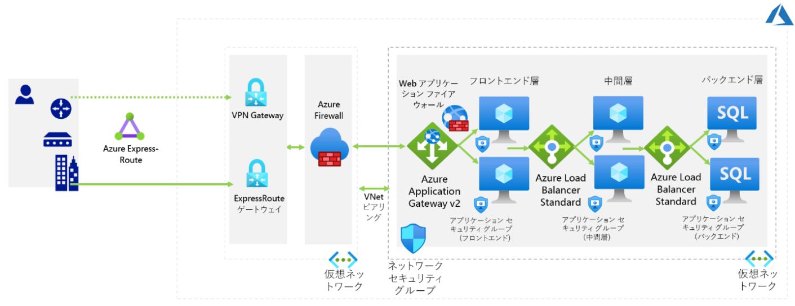

**ネットワーク インフラストラクチャ ソリューションを設計する**

***

# BI アプリケーションの 3 層ネットワーク ソリューションを設計します

ソリューション例

設計には、Azure ExpressRoute、VPN ゲートウェイ、アプリケーション ゲートウェイ、Azure ファイアウォール、および Azure ロード バランサーが含まれる場合があります。ネットワーク コンポーネントは仮想ネットワークにグループ化する必要があり、ネットワーク セキュリティ グループを考慮する必要があります。

- BI アプリケーションは エンタープライズアプリケーションとして分類されるため、可用性 SLA は99.99% である必要があります。このレベルの可用性を実現するには、アプリケーションをホストする Azure VM を Azure 可用性ゾーンにデプロイする必要があり、これは、使用するロード バランサーがゾーンの冗長性をサポートしている必要があることを意味します。

- 社内 (プライベート) ゾーン冗長 Azure Load Balancer 標準 SKU とゾーン冗長の AzureApplication Gateway v2 のいずれかを選択できます。後者は、データベースの更新をサポートするデータ駆動型の社外および社内アプリが、SQL インジェクションやクロスサイト スクリプティングなどの一般的な Web およびデータベースの脆弱性を標的とする悪用を特定してブロックするトラフィック検査を実装する必要があるという情報セキュリティおよびリスク チームの要件に対応するためにフロント層に必要です。この機能は、Azure Application Gatewayの Web Application Firewall (WAF) コンポーネントによって提供されます。

- 中間層とバックエンド層の負荷分散では、Application Gateway とは異なり、非HTTP/HTTPS トラフィックをサポートするゾーン冗長の Azure Load Balancer 標準 SKU を使用する必要があります。

- ネットワーク セキュリティ グループとアプリケーション セキュリティ グループを組み合わせて使用してください。この機能を意図したとおりに機能させるには、SQL Server インスタンスをホストする VM のネットワーク アダプターに特定のアプリケーション セキュリティ グループ (SQLServer など) を割り当てる必要があります。このようにして、SQL Server インスタンスに接続する必要がある層の Azure VM のネットワーク アダプターに割り当てられたネットワーク セキュリティ グループのルール内で、SQL Server アプリケーション セキュリティ グループをルールの送信先として使用できます。

- フェールオーバーを実装するには、まず、障害復旧サイトとして機能する別の Azure リージョンに、対応する 3 層のデプロイを設定する必要があります。Web 層と中間層では、AzureSite Recovery を使用してこれを実現できます。データ層の場合、Always On 可用性グループを拡張して、プライマリ インスタンスからの非同期レプリケーションを使用して、別のリージョンに別の SQL Server インスタンスを含めることができます。

- これには、セカンダリ サイトをホストする仮想ネットワークへのグローバル ピアリングを確立する必要があることに注意してください。フェールオーバーを実行するのに、Azure SiteRecovery を使用できます。 また、階層間の通信や社内ユーザーからのアプリケーションへの接続に使用される名前を表す DNS レコードの IP アドレスを更新するために、DNS の変更も必要になります。

- 中間層で Azure の機能を使用する場合は、プライベート エンドポイントを使用して、ネットワークに対する機能をセキュリティで保護できます。

- コンピューティング ソリューションのコンテナーを使用する場合、コンテナーで Azure VirtualNetwork 機能を使用できるようにします。

- SQL へのプログラムによるアクセス: 管理対象 ID

# アプリケーションに使用されているネットワーク技術

|ネットワークの要件 |BI アプリケーション|
|:----|:----|
|Web 層の負荷分散 |Web Application Firewall (WAF) を備えた Azure Application Gateway v2|
|中間層の負荷分散 |Azure Load Balancer Standard|
|データ層の負荷分散 |Azure Load Balancer Standard|
|層間のトラフィック フィルタリング |アプリケーション セキュリティ グループと組み合わせたネットワーク セキュリティ グループ|
|高可用性ネットワーク コンポーネント: |Azure Load Balancer Standard (ゾーン冗長)Application Gateway v2 (ゾーン冗長)|
|ディザスター リカバリー ネットワーク コンポーネント|グローバル仮想ネットワーク ピアリングDNS (Azure プライベート DNS またはカスタムDNS、AD DS 統合 DNS ゾーンのサポートを含む)|

# ハイブリッド接続と仮想ネットワーク接続 (トポロジ、プライマリおよびバックアップの相互接続性、トラフィック フィルタリングなど) に使用されるネットワーク技術

|ハイブリッド接続 |仮想ネットワークの接続性|
|:----|:----|
|トポロジ: ハブアンドスポーク (シングル エントリポイント)|トポロジ: ハブ アンド スポーク|
|プライマリ相互接続技術: ExpressRoute (ゾーン冗長)|プライマリ相互接続技術: 仮想ネットワーク ピアリング|
|バックアップ相互接続技術: VPN ゲートウェイ(ゾーン冗長)|バックアップ相互接続技術: N/A|
|トラフィック フィルタリング Azure Firewall |トラフィック フィルタリング Azure ファイアウォール(スポーク全体)仮想ネットワーク内のネットワーク セキュリティ グループとアプリケーション セキュリティ グループ|
|トラフィック ルーティング: BGP |トラフィック ルーティング: BGP + Azure ユーザー定義ルート|

