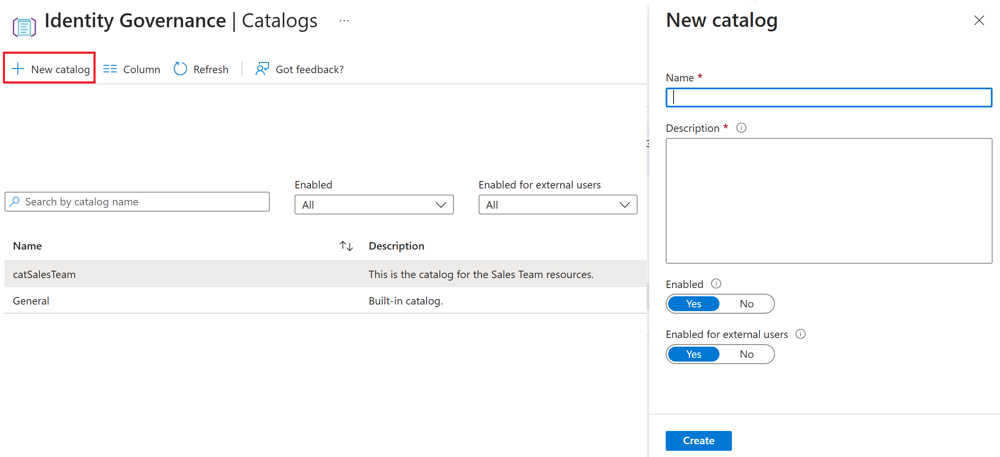
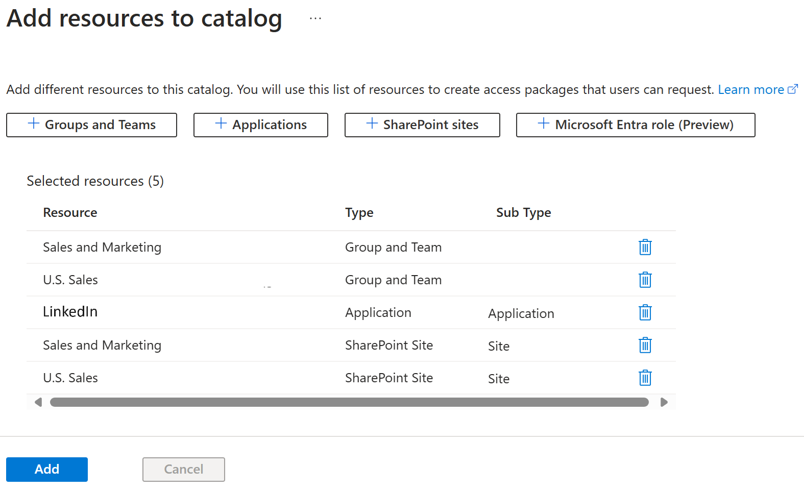

---
lab:
    title: 'Lab 1: Building a catalog for use in Entitlement'
    module: 'Module : Deploying access using Microsoft Entra entitlement management'
---

# Lab: Microsoft Entra エンタイトルメント管理でカタログを作成する

## Lab scenario

中規模のソフトウェア開発会社で、IT 部門はエンタイトルメント管理に Microsoft Entra を実装することを決定しました。主な目標は、組織全体のリソースとアプリケーションへのアクセスを効率化することです。Microsoft Entra を使用すると、ロールまたはプロジェクトに基づいてアクセス パッケージを定義できるため、アクセス権の付与または取り消しのプロセスが簡略化されます。たとえば、新しい開発者がプロジェクトに参加すると、IT 部門は、対応するアクセス パッケージに開発者を割り当てることで、必要なアクセス権を簡単に提供できます。これにより、時間を節約するだけでなく、不正アクセスのリスクも軽減されます。さらに、Microsoft Entra の定期的なアクセス レビューにより、適切なユーザーのみが機密性の高いリソースにアクセスできるようになります。実装ラボでは、IT チームがさまざまなアクセス パッケージを設定し、自動アクセスの割り当てと失効のポリシーを定義し、モック アクセス レビューを実施します。

## 目標

このラボを完了すると、次のことができるようになります。

- カタログを作成します。
- アクセス パッケージを構成します。
- アクセス パッケージをユーザーにデプロイします。
- ユーザーとしてエンタイトルメントを受け入れ、リソースへのアクセスを確認します。
- パッケージへのアクセスを取り消す。

## Lab Setup
  - **所要時間**: 30 分

### 演習 1: 営業チームのカタログを作成する

#### Task 1: カタログの作成

1. Microsoft Entra 管理センターを起動します。 `https://Entra.Microsoft.com`

1. 左側のメニューで、「**Indentity Governance**」、「**エンタイトルメント管理**」の順に移動します。

1. メニューから「**カタログ**」を選択します。
   
 

1. 画面上部の [+ 新しいカタログ] を選択します。

1. 新しいカタログに次の値で名前を付けて説明します。

  | フィールド | 値 |
  | :---  | :---  |
  | 名前  | `catSales` |
  | 説明 | `このカタログを使用して、営業チームのメンバーにリソースを割り当てます。` |
  | 有効 | はい |
  | 外部ユーザーに有効 | いいえ |
  | | |

1. **作成** を選択します

#### Task 2: カタログにリソースを追加する

1. まだアクセスしていない場合は、**Microsoft Entra 管理センター**、**Indentity Governance**、**エンタイトルメント管理**、**カタログ** ページに移動します。

2. 前のタスクで作成した **catSales** を選択します。

3. メニューから「リソース」を選択します。

4. 次に、ページの上部にある **+ リソースを追加します** を選択します。

 

1. Using the selectors at the top of the screen, add the following resources:

  | リソースの種類 | 値 |
  | :---  | :---  |
  | + グループとチーム  | Sales and Marketing, and U.S. Sales |
  | + アプリケーション | LinkedIn |
  | + SharePoint サイト | Sales and Marketings, and U.S. Sales |
  | | |

1. **追加** ボタンを選択します。

#### Task 3: エンタイトルメントを受け取る新しいユーザーを作成する

1. まだアクセスしていない場合は、**Microsoft Entra 管理センター** に移動します。

1. 左側のメニューから、メニューから「**ID**」、「**ユーザー**」、「**すべてのユーザー**」の順に選択します。

1. ページの上部にある **+ 新しいユーザー** を選択します。

1. **基本** タブに値を入力します。

  | フィールド | 値 |
  | :---  | :---  |
  | ユーザープリンシパル名 | `ChrisGr` |
  | 表示名 | `Christopher Green` |
  | パスワードの自動生成 | チェック済み |
  | 有効なアカウント | チェック済み |
  | | |

1. **パスワード**をコピーして、メモ帳などの安全な場所に貼り付けます(パスワードはこのラボの後半で必要になります)。

1. **プロパティ**タブを選択します。

1. **プロパティ** 画面の下部で、**使用場所** = **米国** を設定します。

1. **レビューと作成** を選択し、**作成** を選択します。

#### Task 4: アクセス パッケージを生成する

1. In Microsoft Entra admin center, select **Identity governance** then select **Entitlement management**.

1. From the Entitlement management menu, select **Access packages**.

1. Select **+ New access package** at the top of the screen.

1. Enter the requested values:

  | Field | Value |
  | :---  | :---  |
  | Name  | `pckSales` |
  | Diplay name | `Use this access package to assign resources to members of the Sales team.` |
  | Catalog | catSales |
  | | |

  **Note** - You must pick the catSales catalog we created in the previous task. This will provide the list of resources available to be assigned in this package.  There is a General package that is listed as the default.  If you accidentally chose this, you will not see any resources available.

1. Select the "Resource roles" tab.

1. Select the resources that you want to provide in his Access package, from the items in the catSales catalog. Then use the **Select role** dropdown to set the Role to listed in the table below.

  | Resource Type | Value | Role |
  | :---  | :---  | :--- |
  | + Groups and Teams  | Sales and Marketing | Member |
  | + Applications | LinkedIn | msiam_access |
  | + SharePoint sites | U.S. Sales | U.S. Sales Members |
  | | |

1. Set the **Select role** dropdown to set the Role to **Member** for each item.

1. Use the **Next: Requests>** to move to the Requests tab.

1. For the **Users who can request access** select the option **None (administrator direct assignment only).

1. Set the **Enable** to **Yes**.

1. Move to the **Lifecycle** tab using the labels at the top of the screen.

1. Choose the values to set the lifecycle of the pacakge:

  | Field | Value |
  | :---  | :---  |
  | Access package assignments expire  | Number of Days |
  | Assignments expire after | 30 |
  | Users can request specific timeline | No |
  | Require access reviews | No |
  | | |

1. Select the **Review + create** at the bottom of the screen.

1. Review the values you chose on the Review + create screen.

1. Select **Create** to build your Access package.

#### Task 5: Assign the package to Christopher

1. Make sure you are in **Microsoft Entra admin center**, **Identity governance**, **Entitlement management**, and have the **Access packages** menu open.

1. Select the **pckSales** that we create in the previous task.

1. From the menu select **Assignments**.

1. Select **+ New Assignment** from the top of the screen.

1. For the **Select policy** use the **Initial Policy** provided in the dropdown.

1. Make sure the **User already in my directory** is marked.

1. Select the **Add users** item from the dialog.

1. Find **Christopher Green** in the list of users.  Put a check in the box next to that name.  Then select the **Select** button at the bottom of the screen.

1. Leave the rest of the values set at the defaults.

1. Select the **Add** button at the bottom of the page.

#### Task 6: Check to see if Christopher Green has been added

1. Open a **New InPrivate window** on your browser.

1. Connect to **Microsoft Entra admin center** at `https://entra.microsoft.com` address.

1. Log into the site using your Chistopher Green account and password created earlier.

1. You will be prompted to change your password.  Set a new password and record it in a tool like Notepad for future use.

1. Select **Identity**, then **Users**, then **All Users**, and then select **Christopher Green**.

1. From the menu on the left, select **Groups**.

1. Confirm that you have been granted access to the **Sales and Marketing** group, per the Access Package.

1. From the menu on the left, select **Applications**.

1. Confirm that you have access to the **LinkedIn**.

#### Task 7: Challenge - Dynamic changes to the Access package

  **Note** - This task does not going to have step by step instructions. You are provide the set of tasks, and you can reference previous steps above to remind you of where to make specific changes.

- Make sure you logged into **Microsoft Entra admin center** as your admin account.
- Open your **pckSales** Access package.
- Go to the **Resources roles** and choose to remove the **Sales and Marketing** group and add in the **U.S. Sales** group instead.
- Use the **Assignments** tab to **Reprocess** the assignment.
- Log out and log back in as Christopher Green.  Note that the group assignments have changed.  That quick and easy.
- Revoke access by deleting the Assignment for Christopher Green.

### Conclusion
This is a simple lab to demo the basic features of Entitlement management.  Think of the option you could use this feature for; and the advanced configuration options you could configure within the lab.
