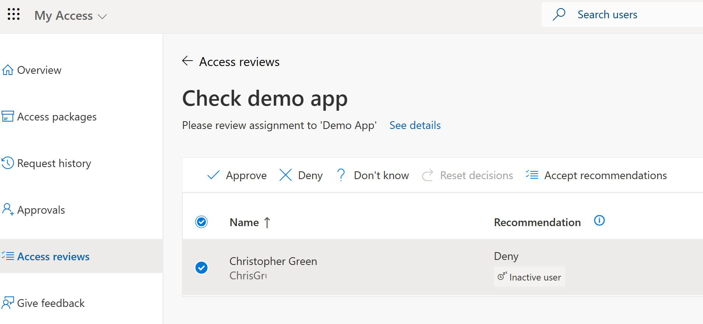

---
lab:
    title: 'Lab 2: - Create and manage an Access review'
    module: 'Module : Deploying access using Microsoft Entra entitlement management'
---

# Lab 2: アクセス レビューを作成して管理する

## ラボシナリオ

アクセス レビューは、適切なユーザーのみがセキュリティで保護されたリソースと情報にアクセスできるようにするのに役立ちます。アクセス レビューは 1 回限りまたは定期的な期間に設定でき、レビュー担当者はユーザー ロール、最終サインイン、リスク レベルなどの要素に基づいてアクセスを承認または拒否できます。これらのレビューの結果は、ユーザーのアクセス権を更新するために使用でき、会社のポリシーとコンプライアンス要件に合致していることを確認できます。この会社では、従業員が会社内でロールを変更するときにアクセス レビューを使用します。たとえば、従業員が営業職からマーケティング職に異動した場合、特定の営業データベースやアプリケーションにアクセスする必要がなくなる場合があります。アクセス レビューは、これらの不要なアクセス許可を特定し、会社がそれらを取り消すことができるようにするのに役立ち、それによって不正アクセスやデータ漏洩のリスクを軽減します。

#### **所要時間**: 15 分

### Exercise 1 - LinkedInにアクセスしているユーザーの中に、そのリソースを使うべきでないユーザーがいないことを確認する。

#### Task 1 - アクセス レビューの作成 - レビューの種類

1. グローバル管理者アカウントを使用して https://entra.microsoft.com にサインインします。

2. 「**Indentity Governance**」を選択します。

3. 「**アクセスレビュー**」を選択します。

4. 上部のメニューで、 **+ 新しいアクセス レビュー** を選択します。

5. **新しいアクセス レビュー** ウィンドウで、**レビュー対象を選択する** ドロップダウンの **アプリケーション** 項目を選択します。

6. **+ アプリケーションの選択** を使用して、リストから **LinkedIn** を選択します。

7. **スコープ** で **すべてのユーザー** を選択します。

8. 画面の下部にある 「**次へ: レビュー**」 ボタンを選択します。

#### Task 2 - アクセス レビューの作成 - レビュー

1. **複数ステージのレビュー** ボックスに一時的にチェックマークを付けます。

 **Note** - ここでは、Access レビューに複数のレイヤーを設定することを選択できます。これは非常に重要なリソースに使用し、1 人のユーザーのレビューによって重要なリソースがユーザー アクセスに追加されたり削除されたりしないようにします。マルチステージを構築/テストするつもりはありません。しかし、プロセスは非常に似ています。

1. **複数ステージのレビュー** ボックスのチェックマークを外します。

1. **レビュー** ページに以下の値を入力します。

| フィールド名 | 値 |
| :--- | :--- |
| レビュー担当者を選択する | ユーザーまたはグループが選択済み -- Adele Vance |
| 期間 (日数) | 5 |
| 確認の繰り返し | 毎月 |
| 開始日 | 今日 |
| 終了 | 複数回の発生後に終了 |
| 発生回数 | 3 |
| | |

#### Task 3 - アクセス レビューを作成する - 設定

1. **リソースへの結果の自動適用** チェックボックスはオフの状態のままにします。

 **Note** - レビューが完了した後に結果を検証するようにしたいと考えています。

1. **レビュー担当者が応答しない場合** の **アクセス権の削除** オプションを選択します。

 **Note** - これは、セキュリティのレベルを制御するために使用できる設定です。安全性の低いセキュリティ体制でレビューが応答しない場合は、 **アクセスを承認する** を取得できます。非常に安全なセキュリティ体制では、アクセスの削除を使用できます。独自のソリューションを実装する場合は、自社に最適なものを選択してください。

1. **レビュー終了時の通知の送信先** でこのラボで使用している管理者アカウント(Mod Administrator)を選択します。

1. **レビュー担当者の意思決定ヘルパーを有効にする** は既定値のままにします。

1. **レビュー担当者のメールの追加コンテンツ** に次の値を入力します。 `できるだけ早くアクセスレビューを完了してください。`

1. **次へ: 確認と作成** を選択します。

1. レビュー名と説明に次の値を入力します。

| フィールド名 | 値 |
| :--- | :--- |
| レビュー名 | `Check LinkedIn` |
| 説明 | `このアクセスレビューでは、適切な人がLinkedInにアクセスできるかどうかをチェックします。` |
| | | 

#### Task 4 - Adele としてログインし、アクセス レビューを実行します。

1. ID、ユーザー、すべてのユーザーから **Adele Vance** を選択して、パスワードのリセットを選択します。一時パスワードが発行されるのでメモしておきます。

2. ブラウザーで「新しい InPrivate ウィンドウ」を開き、 `https://outlook.office.com/` にアクセスします。

3. Adele Vance としてログインします。

 **Note** - **Microsoft Security** から **Action required: Review access to the LinkedIn...** のメールが届いている必要があります。

4. **Start review >** ボタンを選択します。

 

5. **Christopher Green** のチェックをします。

6. トップメニューから **拒否** オプションを選択します。

7. リソースへのアクセスを拒否する理由を入力します。例：販売キャンペーンは終了し、Christopher はもうアクセスする必要はない

8. 残りのすべてのユーザーをチェックして、**承認する** を選択します。

9. リソースへの継続的なアクセスを承認する理由を入力します。例：問題ありません

#### Task 5 - Confirm the Access review results

1. グローバル管理者アカウントを使用して https://entra.microsoft.com にサインインします。

1. **Identity governance** を開きます。

1. **アクセスレビュー** を選択します。

1. このラボで前に作成した **Check LinkedIn** レビューを選択します。

1. AdeleV からの応答を確認します。
