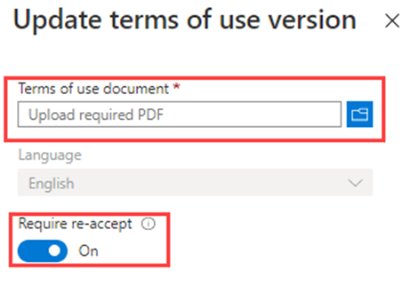

---
lab:
    title: 'Lab 3: - Add terms of use and acceptance reporting'
    module: 'Module : Deploying access using Microsoft Entra entitlement management'
---

# Lab 3: 利用規約と同意レポートを追加する

## ラボシナリオ

Microsoft Entra の使用条件ポリシーは、組織がエンド ユーザーに情報を提示するために使用できる簡単な方法を提供します。このプレゼンテーションにより、ユーザーは法的要件またはコンプライアンス要件に関連する免責事項を確認できます。この記事では、利用規約 (ToU) ポリシーの使用を開始する方法について説明します。組織の ToU ポリシーを作成して適用する必要があります。

#### **所要時間**: 20 分

### 演習 1 - 利用規約の設定とテスト

#### Task 1 - 利用規約を追加する

**重要** 
- Microsoft Entra ID の使用条件を使用および設定するには、以下のサブスクリプションが必要です：
- Microsoft Entra ID Premium P1、P2、EMS E3、または EMS E5 サブスクリプション。
- これらのサブスクリプションをお持ちでない場合は、Microsoft Entra ID Premiumのトライアルをご利用ください。
- 次の管理者アカウントのいずれかを使用します：
  - グローバル管理者
  - セキュリティ管理者
  - 条件付きアクセス管理者

1. グローバル管理者アカウントを使用して https://entra.microsoft.com にサインインします。

2. 「**Indentity Governance**」を選択します。

3. メニューの **エンタイトルメント管理** で、**利用規約** を選択します。

4. **利用規約** ページのトップ メニューで、**+ 新しい条件** を選択します

    

5. **名前** ボックスに「**Testing terms of use**」と入力します。

    **Note** - これは、Azure portal で使用される使用条件です。

6. **利用規約のドキュメント** ボックスを選択し、最終的な利用規約 PDF を参照して選択します。

   [サンプルPDFドキュメント](https://github.com/naonao71/note/blob/main/SC-5008/Labs/Contoso_TermsOfUse.pdf)を入手してください。

7. **表示名** ボックスに「**Contoso Terms of Use**」と入力します。

    **Note** -  これは、ユーザーがサインインするときに表示されるタイトルです。

8. 利用規約ドキュメントの言語として **日本語** を選択します。

   **Note** - 言語オプションを使用すると、それぞれ異なる言語の複数の利用規約をアップロードできます。エンドユーザーに表示される利用規約のバージョンは、ブラウザーの設定に基づきます。

9. エンドユーザーが利用規約に同意する前に表示するように要求するには、**ユーザーは利用規約を展開する必要があります** を **オン** に設定します。

10. エンドユーザーがアクセスするすべてのデバイスで利用規約に同意するように要求するには、**各デバイスでユーザーによる同意が必要** を **オフ** に設定します。このオプションが有効になっている場合、ユーザーは追加のアプリケーションのインストールを求められる場合があります。

    **警告** - すべてのデバイスで同意するには、ユーザーがアクセスする前に各デバイスを Microsoft Entra ID に登録する必要があります。この設定を **オン** にすることをお勧めします。ただし、よりクリーンなラボの目的で、Offを使用しています。

11. 使用条件の同意をスケジュールに従って期限切れにする場合は、**同意の期限** を **オン** に設定します。**オン** に設定すると、2 つの追加のスケジュール設定が表示されます。

12. [以下の日付から期限切れになります] と [頻度] の設定を使用して、利用規約の有効期限のスケジュールを指定します。次の表は、いくつかの設定例の結果を示しています。

    | 以下の日付から期限切れになります | 頻度 | 結果 |
    |---|---|---|
    | 今日の日付 | 毎月 | 本日より、ユーザーは利用規約に同意し、毎月再度同意する必要があります。|
    | 将来の日付 | 毎月 | 本日より、ユーザーは利用規約に同意する必要があります。将来の日付が発生すると、同意は期限切れになり、ユーザーは毎月再同意する必要があります。 |

    たとえば、有効期限を 1 月 1 日に、頻度を **毎月** に設定した場合、2 人のユーザーに対して有効期限は次のようになります。

    | ユーザー | 最初の受け入れ日 | 初回有効期限 | 2回目の有効期限 | 3回目の有効期限 |
    |---|---|---|---|---|
    | Alice | 1月1日 | 2月1日 | 3月1日 | 4月1日|
    | Bob | 1月15日 | 2月1日 | 3月1日| 4月1日|

13. **もう一度同意を求めるまでの期間 (日数)** 設定を使用して、ユーザーが利用規約に再同意する必要があるまでの日数を指定します。これにより、ユーザーは自分のスケジュールに従うことができます。たとえば、期間を 30 日間に設定した場合、2 人のユーザーに有効期限が発生すると、次のようになります。

    | ユーザー | 最初の受け入れ日 | 初回有効期限 | 2回目の有効期限 | 3回目の有効期限 |
    |---|---|---|---|---|
    | Alice | 1月1日 | 1月31日 | 3月2日 | 4月1日 |
    | Bob | 1月15日 | 2月14日 | 3月16日| 4月15日 |

    **Note** - **同意の期限** と **もう一度同意を求めるまでの期間 (日数)** の設定を一緒に使用できますが、通常はどちらか一方を使用します。

14. **条件付きアクセス** で、**カスタム ポリシー** を選択します。

    **IMPORTANT** - 条件付きアクセス ポリシー制御 (使用条件を含む) では、サービス アカウントに対する適用はサポートされていません。条件付きアクセス ポリシーからすべてのサービス アカウントを除外することをお勧めします。

    カスタム条件付きアクセス ポリシーを使用すると、特定のクラウド アプリケーションやユーザー グループに至るまで、詳細な利用規約を作成できます。詳細については、「https://docs.microsoft.com/en-us/azure/active-directory/conditional-access/require-tou」を参照してください。

15. 完了したら、 **作成** を選択します。

16. 利用規約が作成されると、条件付きアクセス ポリシー ページに自動的にリダイレクトされます。ページの **名前** ボックスに「**Enforce ToU**」と入力します。

17. **割り当て** で、 **ユーザー** を選択します。

18. **対象** タブで、**ユーザーとグループの選択** チェック ボックスで **ユーザーとグループ** をオンにします。

19. **選択** ウィンドウで、使用条件ポリシーのテストに使用する **Adele Vance** を選択します。

   **警告** - 管理者アカウントを選択する場合は、すべての条件付きアクセス ポリシーと同様に、条件付きアクセス ポリシーを変更するのに十分なアクセス許可を持つ別のアカウントがあることを確認してください。これは、条件付きアクセス ポリシーによって望ましくない結果が発生した場合に、管理者アカウントがロックアウトされないようにするためです。

20. **ターゲットリソース** を選択します。

21. **すべてのクラウド アプリ** を選択します。

22. **アクセス制御** で、**許可** を選択します。

23. **許可** ウィンドウで、**Testing terms of use** を選択し、[ 選択] を選択します。

24. **ポリシーの有効化** で、 **オン** を選択します。

25. 完了したら、 **作成** を選択します。

    

26. 自分のアカウントを使用することを選択した場合は、ブラウザを更新できます。再度サインインするように求められます。サインインするときは、利用規約に同意する必要があります。

#### Task 2 - Adele としてログイン
1. 新しい InPrivate ブラウザー ウィンドウを開きます。

2. https://portal.azure.com に接続します。

3. すでにログインしていると表示される場合は、画面の右上にあるログインしたユーザー名を選択し、[別のアカウントでサインイン]を選択します。

4. Adele としてログインします。

    | 設定 | 入力する値 |
    | :--- | :--- |
    | ユーザー名 | **AdeleV@** `<<your domain name>>.onmicrosoft.com` |
    | パスワード | パスワードを入力します |

5. Adele のログインを検証します。

6. 利用規約が表示されます。

7. **承諾する** または **拒否** を選択できます。

    **Note**: **拒否**を選択した場合、今後AdeleVとしてログインする際には、再度利用規約を表示して承諾する必要があります。

    **Note**: 利用規約が表示されるまでに数分かかる場合や、ポータルからログアウトして再度ログインできる場合があります。

#### Task 3 - 承諾したユーザーと拒否したユーザーのレポートを表示する

利用規約ページには、承諾したユーザーと拒否したユーザーの数が表示されます。これらのカウントと、同意/拒否した人は、利用規約の存続期間中保存されます。

1. Microsoft Azure の **Identity Governance** > **利用規約** で、利用規約を見つけます。

2. 利用規約については、**承諾済み** または **拒否済み** の下の番号を選択して、ユーザーの現在の状態を表示します。

    

3. この演習では、利用規約に同意または拒否することはできません。次の例では、**承諾済み** の値が選択されています。利用規約に同意したユーザーの報告されたユーザー情報を確認できます。

    

4. **利用規約の同意** ページで、**ダウンロード** を選択して同意レポートをダウンロードします。

5. **Identity Governance | 利用規約** ページの上部のメニューから **監査ログの表示** を選択して監査ログのアクティビティを表示します。

#### Task 4 - ユーザーにとっての利用規約の表示

1. 利用規約が作成されて適用されると、スコープ内のユーザーに利用規約ページが表示されます。

    

2. ユーザーは利用規約を表示し、必要に応じてボタンを使用してズームインおよびズームアウトできます。

    

3. モバイルデバイスでは、次の例のように利用規約が表示されます。

    

#### Task 5 - ユーザーが利用規約を確認する方法

ユーザーは、次の手順を使用して、同意した使用条件を確認および確認できます。

1. https://myapps.microsoft.com を参照し、ユーザー アカウントを使用してサインインします。

2. ユーザー プロファイル写真を選択し、**アカウントを表示** を選択します。**Overview** ページで、**VIEW SETTINGS AND PRIVACY** を選択します。

3. **Settings & Privacy** ページで **Privacy** タブを選択します。

4. **Organization’s notice**で、同意した利用規約を確認することができます。

#### Task 6 - 利用規約の詳細の編集

利用規約の詳細の一部は編集できますが、既存のドキュメントを変更することはできません。次の手順では、詳細を編集する方法について説明します。

1. グローバル管理者として https://entra.microsoft.com にサインインします。

2. Microsoft Entra ID 項目を開き、メニューから **Identity Governance** を選択します。

3. 左側のナビゲーション メニューの **エンタイトルメント管理** で、**利用規約** を選択します。

4. 編集する利用規約を選択します。

5. 上部のメニューで、**条件の編集** を選択します。

6. **利用規約の編集** ウィンドウでは、次の項目を変更できます。

    - **名前** – これは、エンド ユーザーと共有されていない 利用規約 の内部名です
  
    - **ユーザーは利用規約を展開する必要があります** – これを **オン** に設定すると、最終使用者は利用規約ドキュメントに同意する前に拡張するように強制されます。

    - 既存の利用規約ドキュメントを更新します。

    - 既存の使用条件に言語を追加できる すべてのデバイスでユーザーに同意を求める、同意の有効期限が切れる、再同意までの期間、条件付きアクセス ポリシーなど、変更する他の設定がある場合は、新しい使用条件を作成する必要があります。

    

7. 完了したら、**Save** を選択して変更を保存します。

#### Task 7 - 既存の利用規約ドキュメントを更新する

場合によっては、利用規約の更新を求められる場合があります。

1. 編集する利用規約を選択します。

2. 上部のメニューで、**条件の編集** を選択します。

3. **言語オプション** テーブルで、更新する使用条件の言語を特定し、操作 列で **更新** を選択します。

    

4. **使用条件のバージョンの更新** ウィンドウで、利用規約ドキュメントの新しいバージョンをアップロードできます。

5. さらに、次回のサインイン時にこの新しいバージョンを受け入れるようにユーザーに要求する場合は、**再承諾が必要** 切り替えボタンを使用できます。ユーザーに再度承諾を求めない場合、以前のは最新の状態のままで、以前に承諾していない新規ユーザーや同意の有効期限が切れた新規ユーザーのみに新しいバージョンが表示されます。

    

6. 新しいPDFをアップロードし、再承認を決定したら、**追加**を選択します。

7. これで、**ドキュメント** 列の下に最新バージョンが表示されます。
