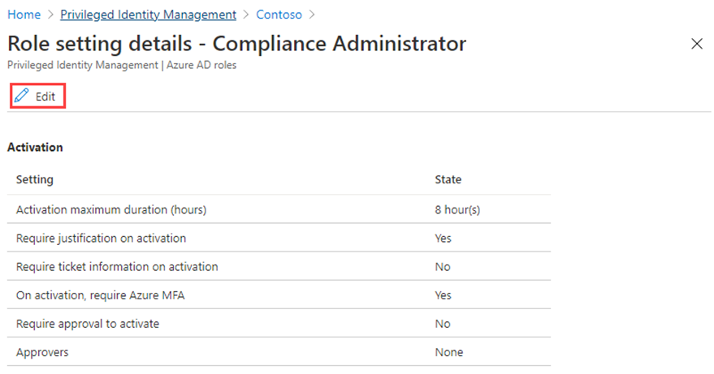

---
lab:
    title: 'Lab 5: - Configure Privileged Identity Management for Microsoft Entra roles'
    module: 'Module : Deploying access using Microsoft Entra entitlement management'
---

# Lab 5: Microsoft Entra ロールの Privileged Identity Management を構成する

## ラボシナリオ

特権ロール管理者は、対象となるロールの割り当てをアクティブ化しているユーザーのエクスペリエンスの変更など、Microsoft Entra 組織内の Privileged Identity Management (PIM) をカスタマイズできます。PIM の設定について理解しておく必要があります。

#### **所要時間**: 30 分

### 演習 1 - Microsoft Entra のロール設定を構成する

#### Task 1 - ロール設定を開く

次の手順に従って、Microsoft Entra ロールの設定を開きます。

1. グローバル管理者アカウントを使用して https://entra.microsoft.com にサインインします。

2. 「**Indentity Governance**」を選択します。

3. **Privileged Identity Management** を選択し、**Microsoft Entra ロール** を選択します。

4. 左側のナビゲーションで、**設定** を選択します。

    

5. ロールのリストを確認し、**ロール名による検索** に「**コンプライアンス**」と入力します。

6. 結果で、 **コンプライアンス管理者** を選択します。

7. ロール設定の詳細情報を確認します。

#### Task 2 - アクティブ化には承認が必要

1. **ロール設定の詳細** ページのトップ メニューで、**編集** を選択します。

    

2. ロール設定の編集 – コンプライアンス管理者 ページで、**アクティブにするには承認が必要です** チェック ボックスをオンにします。

3. **承認者の選択** を選択します。

4. **メンバーの選択** ウィンドウで、管理者アカウント(Mod Administrator)を選択し、**選択** を選択します。

    

5. ロール設定を構成したら、**更新** を選択して変更を保存します。

### 演習 2 - Microsoft Entra ロールを使用した PIM

#### Task 1 - ロールの割り当て

Microsoft Entra ID を使用すると、グローバル管理者は永続的な Microsoft Entra 管理者ロールの割り当てを行うことができます。これらのロールの割り当ては、Microsoft Entra 管理センター、Azure portal、または PowerShell コマンドを使用して作成できます。Privileged Identity Management (PIM) サービスでは、特権ロール管理者が永続的な管理者ロールの割り当てを行うこともできます。さらに、特権ロール管理者は、ユーザーを Microsoft Entra 管理者ロールの対象にすることができます。適格な管理者は、必要なときにロールをアクティブ化でき、完了すると権限の有効期限が切れます。

次の手順に従って、ユーザーを Microsoft Entra 管理者ロールの対象にします。

1. グローバル管理者アカウントを使用して https://entra.microsoft.com にサインインします。

2. 「**Privileged Identity Management**」を選択します。

    **Note** - これは、**Identity Governance** - **Privileged Identity Management** のメニューにあります。

3. **Privileged Identity Management** ページの左側のナビゲーションで、 **Microsoft Entra ロール** を選択します。

4. クイック スタート ページの左側のナビゲーションで、**ロール** を選択します。

5. 上部のメニューで、**+ 割り当ての追加** を選択します。

    

6. **割り当ての追加** ページの **メンバーシップ** タブで、設定を確認します。

7. **ロールの選択** メニューを選択し、**コンプライアンス管理者** を選択します。

8. **名前でロールを検索** フィルターを使用して、ロールを見つけることができます。

9. **メンバーの選択** で、**メンバーが選択されていない** を選択します。

10. **メンバーの選択** ウィンドウで、**Miriam Graham** を選択し、**選択** を選択します。

11. **割り当ての追加** ページで、**次へ >** を選択します。

12. **設定** タブの **割り当ての種類** で、使用可能なオプションを確認します。このタスクでは、デフォルト設定の **対象** を使用します。

    - 対象な割り当てでは、ロールのメンバーがロールを使用するためのアクションを実行する必要があります。アクションには、多要素認証 (MFA) チェックの実行、業務上の正当な理由の提供、指定された承認者からの承認の要求が含まれる場合があります。
    - アクティブな割り当てでは、メンバーがロールを使用するためにアクションを実行する必要はありません。アクティブとして割り当てられたメンバーには、常にロールに割り当てられた権限があります。

13. 残りの設定を確認し、**割り当て** を選択します。

#### Task 2 - Miriam でログインする

1. 新しい InPrivate ブラウザー ウィンドウを開きます。

2. Microsoft Entra 管理センター (https://entra.microsoft.com) に接続します。

3. Miriam でログインします。

   | フィールド名 | 値 |
   | :--- | :--- |
   | ユーザー名 | **MiriamG@** `<<your domain.onmicrosoft.com>>` |
   | パスワード | パスワードを入力します。 |

    > Miriam Graham のパスワードのリセットをしてログインします。 

4. **ID** メニューから**ユーザー** を開き、**すべてのユーザー** を選択します。

5. ユーザーのリストから **Miriam** を見つけます。

6. **概要** ページで、**割り当てられたロール** を探します。

7. **資格のある割り当て** を選択します。

8. コンプライアンス管理者ロールが Miriam で使用できるようになったことに注意してください。

#### Task 3 - Microsoft Entra ロールをアクティブ化する

Microsoft Entra ロールを引き受ける必要がある場合は、Privileged Identity Management の [マイ ロール] を開いてアクティブ化を要求できます。

1. 検索ウインドウで PIM と入力します。

2. **Privileged Identity Management** ページを開きます。

3. **Privileged Identity Management** ページの左側のナビゲーション メニューで、 **自分のロール** を選択します。

4. **自分のロール** ページで、 **資格のある割り当て** の一覧を確認します。

    

5. コンプライアンス管理者ロールの行で、**アクティブ化** を選択します。

6. **アクティブ化 – コンプライアンス管理者** ウィンドウで、**追加の確認が必要です。クリックして続行します** を選択し、指示に従って追加のセキュリティ確認を提供します。認証はセッションごとに 1 回だけ行う必要があります。

    

    **検証** - 現在のラボ環境の構成に基づいて、MFA を構成し、正常にログインする必要があります。

7. 追加のセキュリティ検証が完了したら、**アクティブ化 – コンプライアンス管理者** ウィンドウの **理由** ボックスに、「Tこれが、私がこの役割を有効にした理由です。」と入力します。

    **重要な注意** - 最小原則の原則は、必要な時間だけアカウントをアクティブ化する必要があります。作業を行う必要がある場合は、1.5時間しかかからない場合は、期間を2時間に設定します。同様に、午後3時を過ぎるまで作業ができないことがわかっている場合は、**カスタムアクティブ化の開始時刻** を選択します。

8. **アクティブ化** を選択します

#### Task 4 - スコープが制限されたロールを割り当てる

特定のロールでは、付与されるアクセス許可の範囲を 1 つの管理ユニット、サービス プリンシパル、またはアプリケーションに制限できます。この手順は、管理単位のスコープを持つロールを割り当てる場合の例です。

1. MiriamG のブラウザー ウィンドウを閉じてから、管理者アカウントで **Microsoft Entra 管理センター** を開くことを忘れないでください。

2. **Privileged Identity Management** ページを参照し、左側のナビゲーション メニューで **Azure Microsoft Entra ロール** を選択します。

3. **ロール** を選択します。

4. **ロール** ページのトップ メニューで、**+ 割り当ての追加** を選択します。

5. **割り当ての追加** ページで、**ロールの選択** メニューを選択し、**ユーザー管理者** を選択します。

6. **スコープの種類** メニューを選択し、使用可能なオプションを確認します。ここでは、**ディレクトリ** スコープの種類を使用します。

   **Tip** - 管理単位のスコープ・タイプについて詳しくは、[管理単位の作成または削除](https://learn.microsoft.com/ja-jp/entra/identity/role-based-access-control/admin-units-manage?tabs=ms-powershell) を参照してください。

7. スコープを制限せずにロールを割り当てる場合と同様に、メンバーを追加して設定オプションを完了します。ここでは、**キャンセル** を選択します。

#### Task 5 - 既存のロールの割り当てを更新または削除する

既存のロールの割り当てを更新または削除するには、次の手順に従います。

1. **Privileged Identity Management** > **Microsoft Entra ロール** ページの左側のナビゲーションで **割り当て** を選択します。

2. **割り当て** リストの **コンプライアンス管理者** で、**操作** 列のオプションを確認します。

3. **更新** を選択し、**メンバーシップ設定** ウィンドウで使用できるオプションを確認します。完了したら、ペインを閉じます。

4. **削除** を選択します

5. **削除** ダイアログ ボックスで、情報を確認し、**はい** を選択します。
